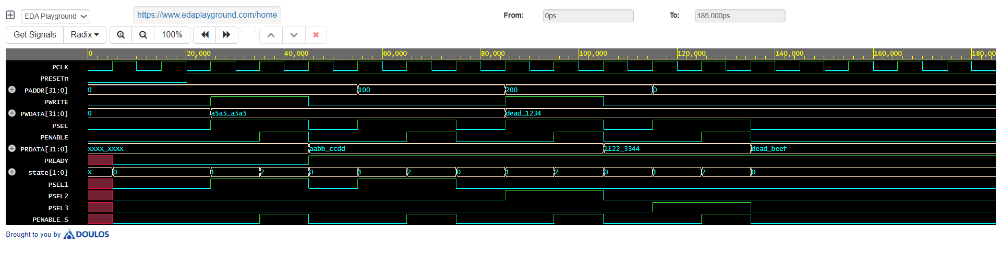

# APB Protocol Controller

> Verilog implementation of an APB (AMBA Advanced Peripheral Bus) Controller  
> with 1 Master and 3 Slaves — simulated on EDA Playground.

---

## Overview

The APB (Advanced Peripheral Bus) is part of the AMBA bus family, designed for  
low-power peripherals. This project implements a fully functional APB controller  
with address decoding, FSM-based transfer control, and 3 peripheral slaves.

---

## Architecture

## FSM States

| State | Value | Description |
|-------|-------|-------------|
| IDLE | `2'b00` | Waiting for transfer request |
| SETUP | `2'b01` | Address and control signals set up |
| ENABLE | `2'b10` | Transfer in progress, PENABLE high |

---

## Signal Description

| Signal | Direction | Description |
|--------|-----------|-------------|
| `PCLK` | Input | Bus clock |
| `PRESETn` | Input | Active-low reset |
| `PADDR[31:0]` | Input | Address bus |
| `PWRITE` | Input | Write=1, Read=0 |
| `PWDATA[31:0]` | Input | Write data |
| `PSEL1/2/3` | Output | Slave select signals |
| `PENABLE` | Output | Enable signal |
| `PRDATA[31:0]` | Output | Read data to master |
| `PREADY` | Output | Transfer complete |

---

## Address Map

| Slave | Address Range | Peripheral |
|-------|--------------|------------|
| Slave 1 | `0x000 – 0x0FF` | UART |
| Slave 2 | `0x100 – 0x1FF` | I²C |
| Slave 3 | `0x200 – 0x2FF` | SPI |

---

## Files

| File | Description |
|------|-------------|
| `apb_controller.v` | APB controller RTL design |
| `tb_apb.v` | Testbench — 4 APB transactions |
| `waveform.png` | EPWave simulation output |

---

## Simulation

Tool: **EDA Playground** (Icarus Verilog + EPWave)

Testbench covers 4 transactions:
- Write to UART (`0x000`, data: `A5A5A5A5`)
- Read from I²C (`0x100`)
- Write to SPI (`0x200`, data: `DEAD1234`)
- Read from UART (`0x000`)

### Waveform Output

---

## How to Simulate

1. Open [EDA Playground](https://edaplayground.com)
2. Paste `apb_controller.v` into the **Design** tab
3. Paste `tb_apb.v` into the **Testbench** tab
4. Select **Icarus Verilog** as simulator
5. Check **Open EPWave after run**
6. Click **Run**

---

## Tools Used

- [EDA Playground](https://edaplayground.com) — Online HDL simulator
- Icarus Verilog — Verilog compiler
- EPWave — Waveform viewer

---

## Author

**Sai Kiran J**  
**Vishwas V**
**Vaishanavi V**
ECE Student — Cambridge Institute of Technology, Bengaluru  

